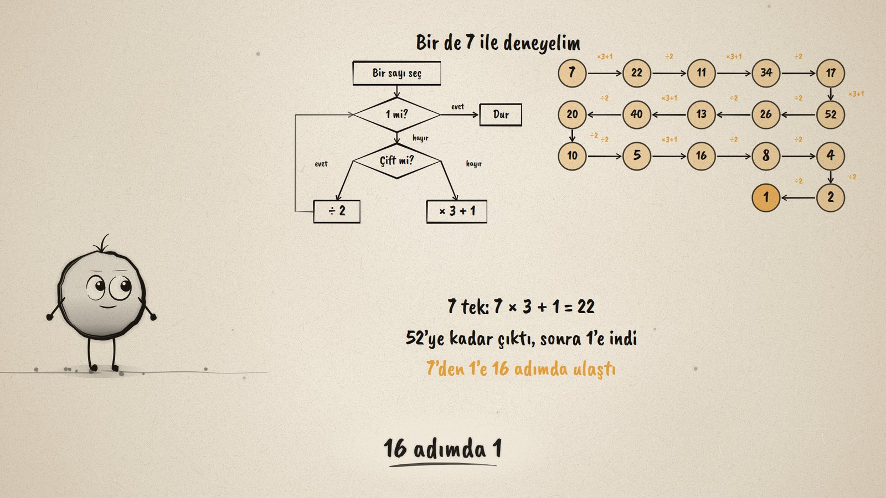
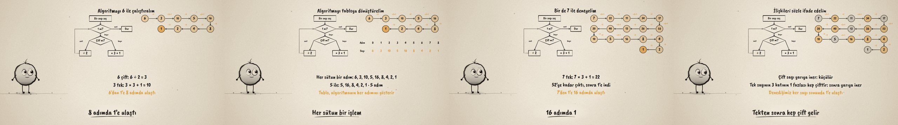

# Sayının Yolculuğu · Interpreting an Algorithm

**▶ Tarayıcıda izleyin / Watch in the browser:** https://hakanatas.github.io/sayinin-yolculugu/ 
**⬇ MP4 + altyazılar / MP4 + subtitles:** [Releases](https://github.com/hakanatas/sayinin-yolculugu/releases) 
**✎ Kullanılan istem / The prompt behind it:** [PROMPT.md](PROMPT.md) 
**🎞 Bütün filmler / All films:** [Nokta'nın Filmleri](https://hakanatas.github.io/nokta-filmleri/?sinif=5)

> **TR —** 5. sınıf matematik "İşlemlerle Cebirsel Düşünme" temasındaki MAT.5.2.4 öğrenme çıktısı için hazırlanmış, tamamen JavaScript ile çizilen 92 saniyelik mürekkep animasyonu. Bir algoritma akış şemasıyla veriliyor: bir sayı seç; 1 ise dur; çiftse 2'ye böl, tekse 3 ile çarpıp 1 ekle; başa dön. Algoritma 6 ile çalıştırılıyor: 6, 3, 10, 5, 16, 8, 4, 2, 1; 8 adımda 1'e ulaşıyor. Algoritmik yapı tabloya dönüştürülüyor (adım ve sayı), 5 ile de deneniyor. 7 ile başlayınca sayı önce 52'ye kadar çıkıyor, sonra iniyor; 16 adımda 1. Son olarak ilişkiler sözle ifade ediliyor: çift sayı yarıya iner ve küçülür; tek sayının 3 katının 1 fazlası hep çifttir, bu yüzden ardından yarıya inilir; denenen her sayı sonunda 1'e ulaştı. Altyazılar Türkçe, İngilizce ya da ikisi birlikte seçilebilir.

A 92-second ink animation for **5th-grade maths**. Nokta, the ink character from [The Learning Ink](https://github.com/hakanatas/the-learning-ink), is the guide again. The chains of numbers are not typed in: the film runs the algorithm itself (`run` in `scenes/scene1.js`), and the flowchart lights up the box whose operation was just used.

## Learning outcome

MEB, Türkiye Yüzyılı Maarif Modeli, Ortaokul Matematik, 5th grade, "İşlemlerle Cebirsel Düşünme" theme:

**MAT.5.2.4. Temel aritmetik işlem içeren durumlardaki algoritmaları yorumlayabilme**
- a) Temel aritmetik işlem içeren durumlardaki algoritmik yapıyı inceler.
- b) İncelediği durumlardaki algoritmik yapıyı tablo temsiline veya aritmetik işlemlere dönüştürür.
- c) Dönüştürdüğü algoritmik yapının içerdiği matematiksel ilişkileri sözlü olarak ifade eder.

## Scenes

| # | Time | Scene | What happens | Outcome |
|---|---|---|---|---|
| 1 | 0–10 s | Bir algoritma | The flowchart: even ÷ 2, odd × 3 + 1, stop at 1. | a |
| 2 | 10–28 s | 6 ile | 6, 3, 10, 5, 16, 8, 4, 2, 1: 8 steps. | a, b |
| 3 | 28–46 s | Tablo | Step and number in a table; from 5 it takes 5 steps. | b |
| 4 | 46–64 s | 7 ile | Up to 52, then down to 1 in 16 steps. | a, b |
| 5 | 64–80 s | Sözle | Even numbers are halved; an odd number is always followed by an even one. | c |
| 6 | 80–92 s | Aklında kalsın | Steps in order; tables show the relationships. | a–c |

## Running it

- **Preview:** double-click `index.html` (it works offline).
- **MP4:** run `npm install` once, then `npm run export -- --format=horizontal --captions=tr`.
- **Subtitles and narration:** `npm run srt` writes `out/captions_*.srt` and `narration_notes.txt`.
- **Editing:**
  - Caption text, timings and narration notes: `captions.js`
  - Everything on screen is drawn by `LI.world(t)` in `scenes/scene1.js` (the flowchart, the chains of numbers, the table, the words); the other scenes only set the camera.
  - Nokta's poses: `src/draw/film.js`; layout for 16:9 and 9:16: `src/draw/kd.js`

It uses the same engine as The Learning Ink: `renderFrame(t)` as a pure function of time, seeded randomness, and frame-by-frame export.
